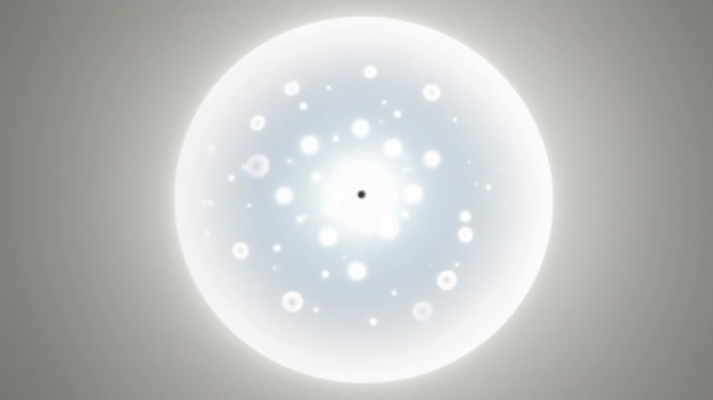

<div align="center">
  <em>Omni-Horn-Orb hypersphere – custom visualisation by the author, 15 February 2026</em>
</div>

# Omni-Horn-Orb Model

**A 5D Geometric Embedding Framework for Unified Cosmology**

Author: Christopher M. Gibson  
Date: February 18, 2026  
Permanent archive: [Zenodo DOI 10.5281/zenodo.18416212](https://doi.org/10.5281/zenodo.18416212)

---

## Current Release  
ROLLBACK EDITION v2

Version 2 implements geometric stabilization of the modulus r and removes the principal structural freedom present in earlier versions.

After dimensional reduction, the effective 4D action contains curvature and non-perturbative contributions of schematic form:

R4 + A(r)/r^2 + B exp(-c/r)

Holonomy quantization tied to the anchor wavelength (lambda_anchor = 2 pi r) constrains spectral structure. The stationary condition yields discrete branches of a transcendental equation. Stability analysis shows only the lowest branch satisfies V''(r) > 0.

The cosmological scale therefore emerges discretely from geometric closure rather than continuous tuning.

---

## Overview

The Omni-Horn-Orb hypersphere embeds a 3D hypersurface in 5D Minkowski space with:

- Horn-topology discreteness  
- Phase holonomy sector (A4)  
- Induced cosmological expansion  
- Geometric eigenmode structure  

The framework investigates whether:

- Late-time acceleration  
- Large-scale CMB power suppression  
- Lepton mass hierarchy  
- Fine-structure constant structure  
- Distance-dependent entanglement phase  
- Gravitational lensing offsets  

can arise from a unified geometric construction.

All predictions are numerically specified in the manuscript and computational modules.

---

## Full Computational Repository

This repository contains the full computational framework supporting the manuscript.

### What is live:

- **`Omni_Horn_Orb_Full_Notebook.ipynb`** – Complete Jupyter notebook with live expansion history, w(z) calculations, and derivational notes  
- **`lepton_lattice.py`** – Lepton mass spectrum from geometric eigenmodes on the equatorial slice  
- **`RK45_expansion.py`** – Runge-Kutta integration of expansion history with dynamic H(z) and w_eff(z)  
- **`metric_derivations_sympy.py`** – Symbolic metric derivations and Christoffel symbols  
- **Manuscript (v2)** – `Key_to_the_Cosmos_ROLLBACK_v2.txt`  
- **Original paper archive** – `Omni-Horn-Orb-Model-20260215.pdf`

---

## Structural Status

- Embedding geometry: defined  
- Induced cosmology: derived  
- Holonomy sector: implemented  
- Radius stabilization: discretized (v2)  
- Full 5D fundamental action derivation: in development  

---

## How to run

All code runs with standard Python packages:

- numpy  
- scipy  
- matplotlib  
- sympy  

Clone the repository and execute directly.

### Quick start

```bash
# Run the live expansion table
python RK45_expansion.py

# Run the lepton masses
python lepton_lattice.py

# Open the full notebook
jupyter notebook Omni_Horn_Orb_Full_Notebook.ipynb
